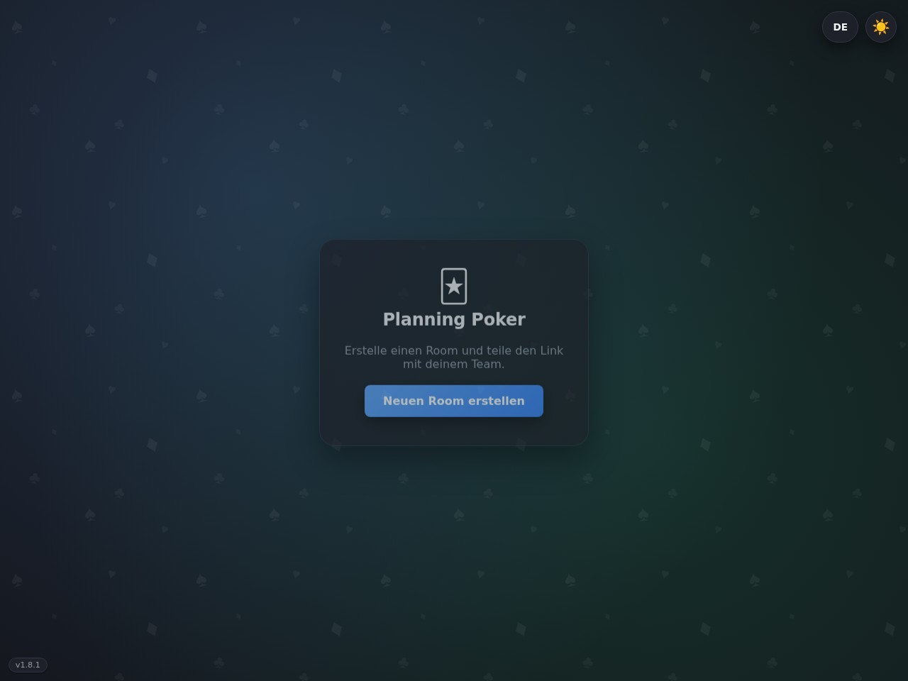
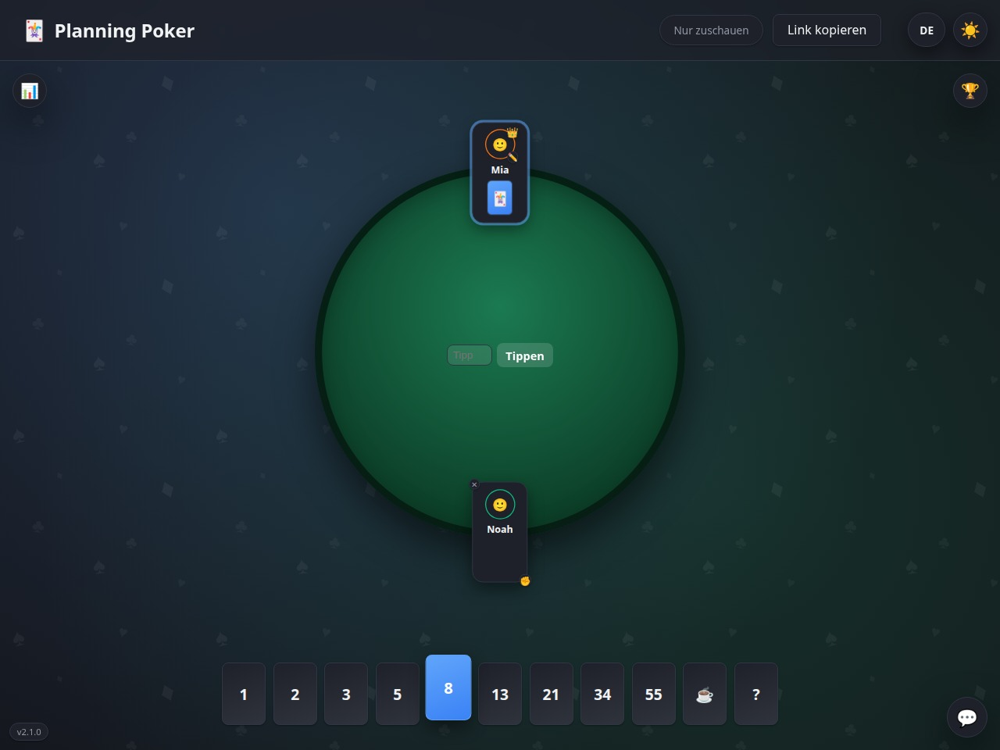
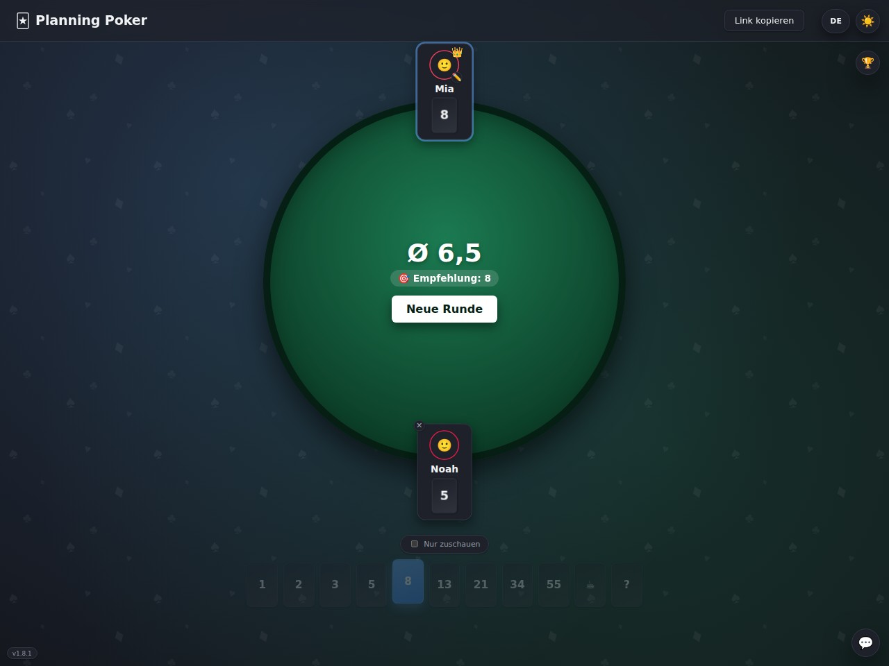
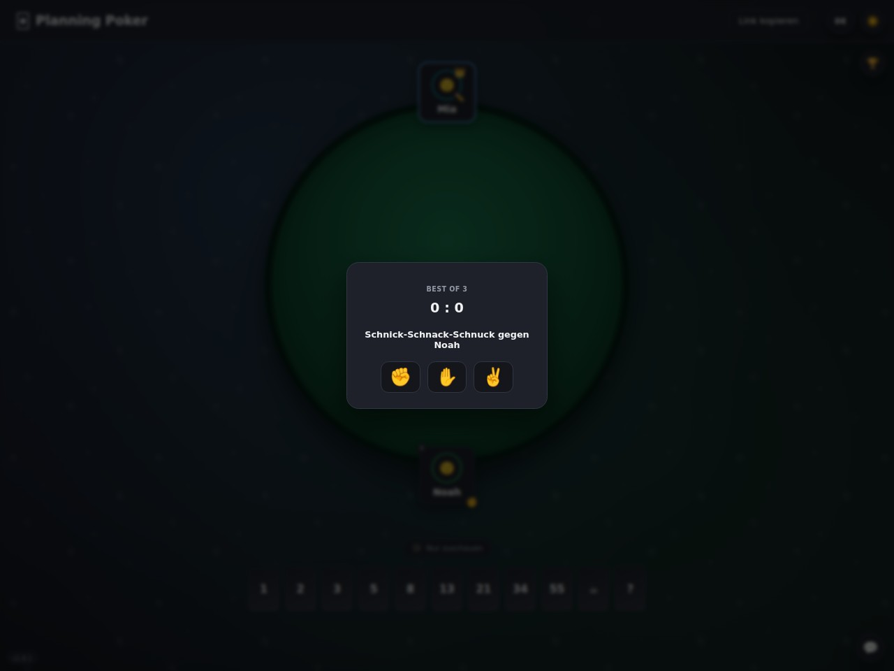
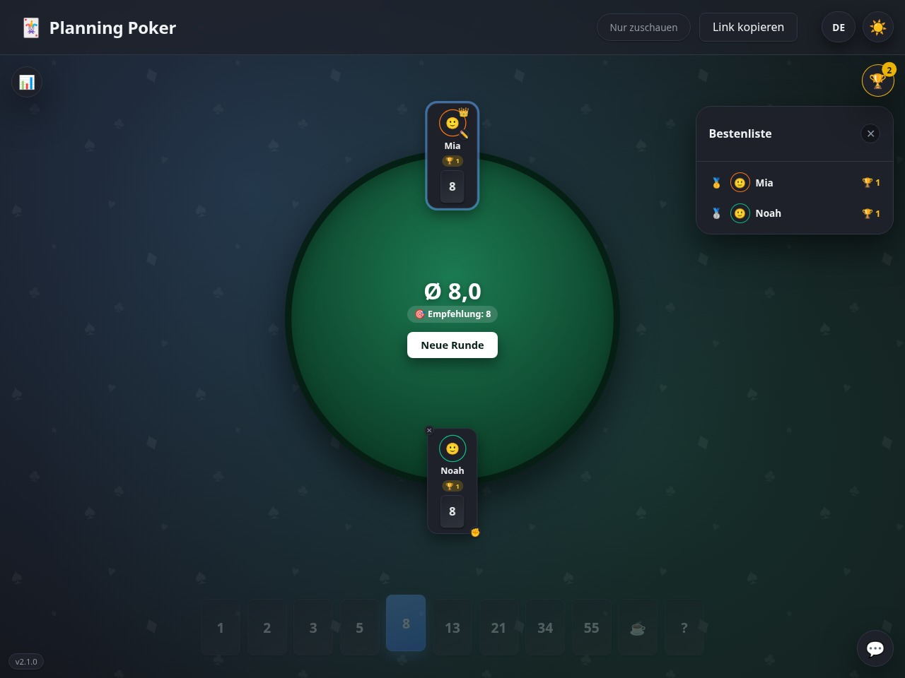

<div align="center">

# 🃏 Planning Poker

[](https://github.com/kaiehrhardt/pp/actions/workflows/release.yml)
[](https://github.com/semantic-release/semantic-release)
[](https://bun.com)
[](./LICENSE)

</div>

A web app for teams to estimate work together via Planning Poker in real time — built with Bun, React, and TypeScript. The UI defaults to German but can be switched to English at any time. See [CONTEXT.md](./CONTEXT.md) for the domain model and [docs/adr/](./docs/adr/) for the architectural decisions.

## Features

- Open a room, share the link, join in seconds — no accounts, no setup
- Fibonacci deck (1–55, plus ☕ and ?), with automatic reveal once everyone's voted
- Average + closest-card recommendation shown after every reveal
- Pick an emoji avatar when joining; spectator mode, host controls (new round, kick), automatic host handover if the host disconnects
- Throw an emoji at another participant, animated flying from you to them
- Mini-games while you wait: guess the round's average, challenge someone to a Rock-Paper-Scissors duel, confetti on a unanimous vote — with a session trophy leaderboard
- Built-in room chat with clickable links and an emoji picker
- German/English language toggle; dark mode only, on purpose — the "light mode" button is a running joke
- Runs standalone via Bun, via Docker Compose (single host, includes Turso + Redis), in Kubernetes (Helm chart included, see [charts/pp](./charts/pp)), or straight from the published image

## Screenshots

<table>
  <tr>
    <td></td>
    <td></td>
    <td></td>
  </tr>
  <tr>
    <td></td>
    <td></td>
  </tr>
</table>

## Prerequisites

- [Bun](https://bun.com) v1.3 or newer (`bun --version`)
- A reachable Redis (or [Valkey](https://valkey.io)) instance — the app pings it at boot and won't start without one. `redis-server` locally, or see [Docker Compose](#docker-compose) below for a zero-setup option.
- No Turso account needed for local dev: `TURSO_DATABASE_URL` defaults to a local file (`file:./dev.db`), created automatically on first run.

## Try it locally

```bash
bun install
bun run dev
```

The server starts with hot reload on [http://localhost:3000](http://localhost:3000). Room state is stored in `./dev.db` (a local libSQL file, gitignored) and cross-connection events flow through your local Redis.

To try the full flow (create a room, join, estimate, throw smileys) you need at least two browser windows/tabs, since each tab simulates its own participant:

1. Open `http://localhost:3000` in the first tab and click **"Neuen Room erstellen"** ("Create new room").
2. Copy the resulting URL (`http://localhost:3000/room/<id>`) — e.g. via the **"Link kopieren"** ("Copy link") button in the room.
3. Open that URL in a second tab (or an incognito window, so it gets its own `localStorage`) and enter a different name.
4. Pick a card in both tabs — once every (non-spectating) participant has voted, the room reveals automatically.
5. Click another participant's tile to throw them a smiley via the emoji picker.

An incognito window matters because the reconnect token lives in `localStorage` per room — two normal tabs in the same browser profile would otherwise reuse the same participant instead of joining a second one.

## Docker Compose

The easiest way to run the whole stack (app + Turso via a local [sqld](https://github.com/tursodatabase/libsql) server + Redis) on one host — either for local debugging or as a lightweight alternative to Kubernetes:

```bash
bun run compose       # production-like, builds from source: docker-compose.yml alone
bun run compose:dev   # debugging: adds docker-compose.dev.yml on top (hot reload, live-mounted src)
bun run compose:prod  # production, no local build: docker-compose.prod.yml, pulls ghcr.io/kaiehrhardt/pp:latest
```

Runs on [http://localhost:3000](http://localhost:3000) either way. `compose` is what a plain `docker compose up` gives you too — the dev overlay is a separate, explicitly-named file (not the auto-loading `docker-compose.override.yml`) so a single-host operator never gets a hot-reload build by accident. `compose:prod` is a standalone file (not an overlay — Compose can't remove the base file's `build:` key) meant to be copied to a host on its own, with no need for a full clone of this repo; edit its `image:` line to pin a specific released version instead of floating on `:latest`. Room state persists in a named volume (`sqld-data`) across `docker compose restart`/`down` (not `down -v`). See [ADR-0003](./docs/adr/0003-turso-and-redis-for-horizontal-scaling.md) for why Turso and Redis are there at all.

## In a single container

```bash
bun run docker:build
```

This builds just the app image — it still needs a reachable Turso (or `sqld`) database and Redis instance, since there's no in-memory fallback (see [ADR-0003](./docs/adr/0003-turso-and-redis-for-horizontal-scaling.md)). `bun run docker:run` (and the equivalent `docker run ghcr.io/kaiehrhardt/pp:latest` using the published image) will crash-loop without `-e REDIS_URL=...` reachable from inside the container, e.g.:

```bash
docker run --rm -p 3000:3000 \
  -e REDIS_URL=redis://host.docker.internal:6379 \
  -e TURSO_DATABASE_URL=http://host.docker.internal:8080 \
  ghcr.io/kaiehrhardt/pp:latest
```

Unless `TURSO_DATABASE_URL` is set, it falls back to an in-container local file (`file:./dev.db`) that's lost when the container is removed — fine for a quick check, not for anything you want to keep. For anything beyond a one-off, use [Docker Compose](#docker-compose) above instead, which wires all of this up for you. The port can be changed via the `PORT` environment variable (`-e PORT=8080 -p 8080:8080`).

A GitHub Actions workflow (`.github/workflows/ci.yml`) runs on feature branches and pull requests (not on `main`): it first runs the typecheck and test suite, then — only if that passes — builds the image and pushes it to GitHub Container Registry, tagged `pr-<number>` for a pull request or `<commit-sha>` for a plain branch push. No extra secrets needed — it authenticates with the workflow's built-in `GITHUB_TOKEN`. The resulting package is private by default; change its visibility under the repo's "Packages" tab if you want it public.

### Kubernetes (Helm)

```sh
helm install pp oci://ghcr.io/kaiehrhardt/charts/pp --version <chart-version>
```

See [charts/pp/README.md](./charts/pp/README.md) for values — multi-replica deployments need Turso and Redis wired up (room state lives in Turso, cross-pod events flow through Redis; see [ADR-0003](./docs/adr/0003-turso-and-redis-for-horizontal-scaling.md)), either an external `TURSO_DATABASE_URL`/`TURSO_AUTH_TOKEN`/`REDIS_URL` via `extraEnv`, or `redis.enabled`/`sqld.enabled` to bundle minimal in-cluster instances of both.

## Releases

Versioning is handled by [semantic-release](https://semantic-release.gitbook.io/) (`.releaserc.cjs`), driven by [Conventional Commits](https://www.conventionalcommits.org/) on `main`: `fix:` → patch, `feat:` → minor, `BREAKING CHANGE:` → major. On every push to `main`, `.github/workflows/release.yml` determines the next version, updates `package.json` and `CHANGELOG.md`, tags the commit, and creates a GitHub release. Requires a `SEMANTIC_RELEASE_TOKEN` repo secret (a PAT with `repo` scope) so the release commit can trigger the follow-up workflow below — the default `GITHUB_TOKEN` can't do that.

Once a release commit lands, `.github/workflows/release-docker.yml` builds the container image and pushes it to GHCR tagged with that version *and* `:latest` (`ghcr.io/<owner>/<repo>:<version>` / `:latest`) — so `:latest` always tracks the most recently released version, not just the latest commit on `main`. The same release run also packages and pushes the Helm chart to GHCR via the `semantic-release-helm3` plugin, keeping `Chart.yaml`'s version in sync with `package.json`.

## Tests & typecheck

```bash
bun test          # domain logic, persistence, and cross-pod Redis relay — needs a reachable Redis (see Prerequisites)
bunx tsc --noEmit # typecheck across the whole project
```

## Project structure

```
src/
├── frontend/        # React UI (landing, join, room, card hand, emoji picker, chat)
└── backend/
    ├── domain/      # pure domain logic (Room, Participant, deck, evaluation, chat)
    │                # + db.ts/schema.sql/store.ts: the Turso-backed persistence layer
    ├── redis/       # Bun.redis pub/sub wrapper (publisher + reconnect-safe subscriber)
    └── ws/          # WebSocket protocol & handler; roomChannel.ts relays state and
                      # duel commands across pods over Redis
```

## License

[MIT](./LICENSE)
